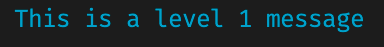
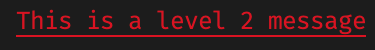
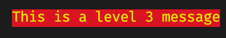

# Camp2 Helpers

## Installation

To install it, add this in your `package.json` file:

```json
"dependencies": {
  "camp2-helpers": "fewlines-education/camp2-helpers#main"
}
```

## Utility functions

### expectMessage

```js
import { expectMessage } from "camp2-helpers";
```

This function modifies the jest [expect](https://jestjs.io/docs/en/expect) function and wrap it in a custom package in order to give an extra option to add a message when jest tests fails in TypeScript.
It is based the package [jest-expect-message](https://www.npmjs.com/package/jest-expect-message) for custom use.

You need to install `jest` for `expect` to be a global variable.

#### Reference

The function `expectMessage(value, message, style)` takes three arguments:

- `value`, the value tested against a matcher. It is the same argument referenced in the [Jest documentation](https://jestjs.io/docs/en/expect#expectvalue).
- `message`, a **string** that is printed only if the expect fails.
- `style`, either:
  - a **string** either being "log", "warning", or "error". They represent default styles given to the messages.
    - 
    - 
    - 
  - an **object** composed of three strings changing respectively the _foreground color_, _background color_ and _effect_ of the message printed.
  ```ts
  {
    fg?: string;
    bg?: string;
    effects?: string;
  }
  ```

#### Example

With pre-defined style:
```js
test("simple test", () => {
  expectMessage(1 + 1, "This is an error message", "error").toBe(11);
});

// This test will fail and print "This is an error message" in yellow with a red background.
```

With your own style:
```js
test("simple test", () => {
  expectMessage(1 + 1, "This is my own error message", {fg: "magenta", bg: "cyan", effects: "reverse"}).toBe(11);
});

// This test will fail and print "This my error message" in magenta with a cyan background and reverse !.
```

#### Documentation

Those are the different values you can use in the `style` object:

| foreground | background | effect     |
| ---------- | ---------- | ---------- |
| black      | black      | reset      |
| red        | red        | bright     |
| green      | green      | dim        |
| yellow     | yellow     | underscore |
| blue       | blue       | blink      |
| magenta    | magenta    | reverse    |
| cyan       | cyan       | hidden     |
| white      | white      |            |

### readCode

```js
import { readCode } from "camp2-helpers";
```

This function uses `fs.readFile` to parse JS files and returns the code as a string.

#### Reference

The function `readCode(path)` takes a one argument and returns a promise with a string.

- `path`, a string refering to the absolute path of a file.

**E.g.**

```js
import { readCode } from "camp2-helpers";

const code = await readCode("path/of/your/file"));
```

It can be used for testing with `jest` the following way.

```js
// index.js
const hello = "Hello World!";
```

```js
// index.test.js
const readcode = require("./readcode");

let code;
beforeAll(() => {
  // Loads the student's code
  code = await readcode("./index.js");

  return code;
});

test("variable 'hello' contains 'Hello World!'", () => {
  return code.then((code) => {
    // Run the code then call the 'hello' variable.
    const hello = eval(code + "; hello;");

    expect(hello).toBe("Hello World!");
  });
});
```

### astNodeParser

```js
import { astNodeParser } from "camp2-helpers";
```

This function is a parser extending the TypeScript parser from [recast](https://www.npmjs.com/package/recast).
It creates a tree of nodes for every section and element of your code. You can read [`recast`](https://www.npmjs.com/package/recast) documentation for more information about the tree parser.

#### Reference

- Cast file into string:

```ts
const code = await readCode("./path/to/file.ts");
```

- Pass the string to the parser, and get the node:

```ts
// Class node example
const classNode = findNode(code, "classNode");
```

- Search deeper into the node:

```ts
const classProperty = findNode(classNode, "classProperty");
```

You can search by name, class member name (e.g. "constructor").

To prevent breaking the tests in case of searching something that is not in the ast,
the function returns "undefined".

⚠️ This is a WIP, if you probably should investigate the `ast` if you can't find what you are looking for.
